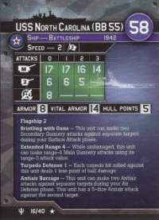

# Welcome to the War at Sea Card Generator Project!
The goal of this project is to create an automated way to reproduce unit cards for the
[Axis and Allies War At Sea](https://boardgamegeek.com/boardgame/25794/axis-allies-war-sea) naval miniatures
game. This reproduction aims to make the cards as close to the originals as possible with some 
minor theme changes (currently all card themes are the same regardless of which set the card belongs to). This
project also aims to make it easy to add new units to the game, creating cards that will fit in
with the design of the original game.

The current data set that is used to create the card was derived from [http://was.tamgc.net](http://was.tamgc.net/) (big shout out to them :)), 
focusing only at the major nations. There are plans to complete
the set once the major nations are finished. A web scraping script has been written to handle pulling the data from the site (see /card_generator/data_collection).

## How it Works
Unit definitions are stored in JSON format, organized into lists that are grouped by nation. The generator consumes
the unit definitions, along with some additional assets (icons, fonts, etc), and spits out a card that is similar to the original
set of cards released with the starter pack. Below is an example of the original USS North Carolina card (left) and 
the reproduced card using this generator (right)

 

## What is Working Right Now
Currently, card generations for ships and submarines is working and is essentially finished. The only remaining work is to finish 
creating assets for the generator to include in the card, this includes the ship silhouettes and blueprint outlines. All other
icons have been created.

As for planes, this is also mostly working. The formatting may need some minor tweaks once the form factor for plane outlines is
set in stone.

## What Needs Done?
**ASSET GENERATION**. Asset creation is the longest and most tedious part of this process. There are nearly 300 units defined
in the current data set, which require roughly 200 unique assets be created in the form of unit outlines. Asset tracking is done
via a [shared spreadsheet](https://docs.google.com/spreadsheets/d/1MUwMda_RZZ0Y9FLbD3wuyJa0KsISesgDZR7cqAH8kMs/edit?usp=sharing). At the moment,
assets exist for all US and HMAS units, however they are incomplete. Some need cleaning up, most need back-lighting and blueprints generated.
Anyone with any inclination towards graphic design feel free to lend a hand. I have been using GIMP up to this point to 
modify images from [Ship bucket](http://www.shipbucket.com/) (huge shout out for saving my sanity).

## How to Generate the Units
Right now there is no single script that is meant to run the generator and create the cards yet, there are however
three test cases (see generator_tests.py) designed to:
1. Generate a card for a single unit
2. Generate all cards for a given nation
3. Generate all cards for all available units

This is only meant for testing at present, later on a proper script will be added when the project is more mature.
**Please note that some assets are not included in the repo**. The font used for most of the card is a paid font that I do
not have rights to redistribute, as such, it is not included here. If anyone knows of a good replaced for https://www.fonts.com/font/komet-flicker/bomber/regular,
please feel free to suggest it. Otherwise, you will either need to purchase the font (currently $10) or change the font
defined in /card_generator/models/definitions. The license on the font allows for images produced to be distributed, but
the TTF file itself for the font cannot be.

## How to Contribute
If you are interested in contributing, please join our discord server at https://discord.gg/EeWxsBqy.
There is also a [guide](readme-resources/War%20at%20Sea%20Card%20Generator%20Silhouette%20Tutorial.pdf) on how to create assets for the cards.